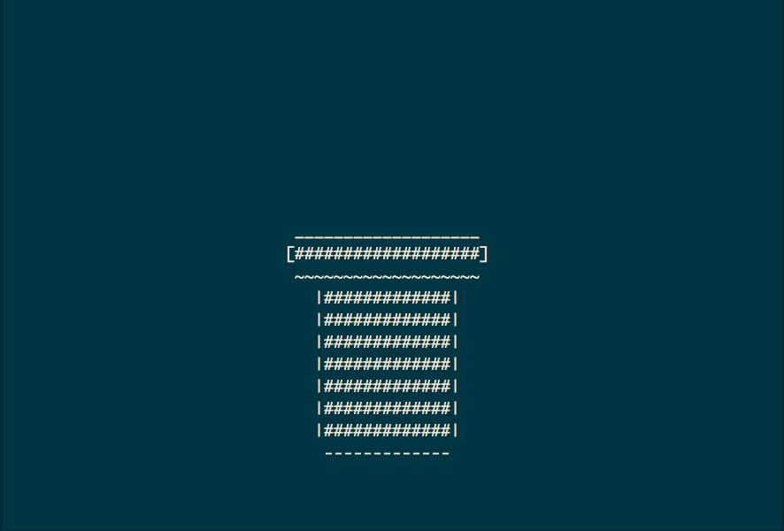

# Magician
Magician is a text-based game engine that supports both Mac and Windows, featuring:

* Text-based image and text fields
* Animation and actions
* Keyboard control and scheduled events

# Getting Start with Magician
To create your own text-based game with Magician, run the following command with the name of your project:

```
chmod 700 tools/new_game.sh
tools/new_game.sh NAME_OF_YOUR_GAME
```

Then you can find your new project under ```projects``` directory. Start by editing the ```main.cpp``` files in ```source``` directory. 

A game is made up of many "scenes" where in each scene there could be multiple "sprites". In ```main.cpp``` you are expected to first initilize your scenes and pass them to the Director class to run. 

Here is a HelloWorld example for creating text-based games with Magician. You can copy and paste it into ```main.cpp```. 

```cpp
#include "Magician.h"

// A simple Hello World game project with Magician

class HelloWorld: public Scene
{
public:
	virtual void initScene() override
	{
		// Create a sprite
		Sprite* image = Sprite::create("HelloWorld.txt");

		// Define position for the sprite
		const int num39 = ConsoleCoord::MAX_COLUMN / 2;
		const int num11 = ConsoleCoord::MAX_LINES / 2;
		image->setCenterPos( Coord(num11, num39) );

		// Add the sprite to the scene
		this->addChild( image );
	}
};

int main()
{
	// Create a scene
	Scene* hello = new HelloWorld();

	// Engine run with the scene
	gMainLoop->runWithScene( hello );
	
	return 0;
}
```

To build the game for the first time, you need to run ```make``` in the Magician's root directory and then run ```make``` in the directory of your game. The executable file should be a ```game.out``` in the root directory of your game. If you are running the HelloWorld example, running the following command in Magician root directory should do the job. 

```
make; pushd projects/NAME_OF_YOUR_GAME/; make; popd
```

If you have multiple scenes, you may want to put them into different source files. Then, you will need to put the file names in ```build/source.mk``` of your game so that the build system could know of their existance. With multiple scenes, you may want to organize them as a linked-list. See the sample games(xmas, cocos, maze) for more information. 

## Classes
Here is a list of classes that you will most often be dealing with. 

| class | description |
|-------|-------------|
 Sprite | an image to be shown in the game scene
 Scene  | game scene, initiates the elements of the scene
 Action | base class of a collection of action class

## Actions
Here is a list of actions that you can use to create a lively game. 

| class | description |
|-------|-------------|
Animation | make an animation out of animation frames
CallFunc | function call wrapped as an action
Jump    | jump action
MoveBy  | move sprite by a given vector
MoveTo  | move sprite to a given coordinate
Repeat  | repeat an action for some given time
Sequence| put actions in a sequence
Sleep   | pause for some given time
Vanish  | make sprite vanish instantly
Appear  | make sprite appear instantly

